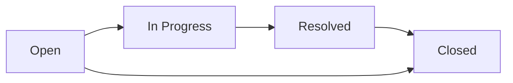

# IT Help Desk System

[](https://github.com/5mlan/it-help-desk-system/actions/workflows/dotnet.yml)


A complete, portfolio-ready IT support ticket system built for Visual Studio with ASP.NET Core MVC, ASP.NET Identity, Entity Framework Core, and SQLite.

The interface is responsive and Arabic-first (RTL). The repository includes authentication, role-based authorization, ticket workflows, comments, dashboard statistics, seed data, and a GitHub-ready structure.

## Features

- Register, sign in, and sign out securely with ASP.NET Identity.
- Three roles: `User`, `Technician`, and `Admin`.
- Create support tickets with category and priority.
- Search and filter tickets by status and priority.
- Assign tickets to support staff and update their status.
- Add a chronological conversation to every ticket.
- Track every ticket event in an audit timeline.
- Calculate an SLA target and highlight overdue tickets.
- Export filtered tickets to Arabic-compatible CSV.
- Close completed tickets.
- Role-aware dashboard statistics and recent activity.
- Admin page for managing user roles.
- Automatic SQLite database creation and demo data.
- Responsive Arabic UI for desktop and mobile.
- GitHub Actions, Dependabot, Docker, and contribution templates.

## Arabic documentation

The complete Arabic explanation of the architecture, database, source code, roles, security, modifications, common errors, and GitHub publishing steps is available in [`docs/PROJECT_GUIDE_AR.md`](docs/PROJECT_GUIDE_AR.md).

## Technology stack

- .NET 8 / ASP.NET Core MVC
- Entity Framework Core 8
- ASP.NET Core Identity
- SQLite
- Razor Views, HTML, CSS, and JavaScript
- GitHub Actions and Docker

## Run in Visual Studio

1. Install **Visual Studio 2022** with the **ASP.NET and web development** workload and the **.NET 8 SDK**.
2. Open `HelpDeskSystem.sln`.
3. Wait for Visual Studio to restore the NuGet packages.
4. Make `HelpDesk.Web` the startup project if it is not selected automatically.
5. Press `F5` or click the green HTTPS run button.

The first launch automatically creates `helpdesk.db`, the Identity tables, roles, demo accounts, and sample tickets. No MySQL installation is required.

## Run with Docker

```bash
docker compose up --build
```

Open `http://localhost:8080`.

## Demo accounts

| Role | Email | Password |
|---|---|---|
| Admin | `admin@helpdesk.local` | `Admin123!` |
| Technician | `tech@helpdesk.local` | `Tech123!` |
| User | `user@helpdesk.local` | `User123!` |

> Change or remove the seeded passwords before deploying the application publicly.

## Ticket workflow



## Project structure

```text
HelpDeskSystem/
├── .github/
├── docs/
├── HelpDeskSystem.sln
├── src/HelpDesk.Web/
│   ├── Controllers/
│   ├── Data/
│   ├── Models/
│   ├── ViewModels/
│   ├── Views/
│   └── wwwroot/
├── database/schema.sql
├── Dockerfile
├── docker-compose.yml
├── screenshots/
├── README.md
└── LICENSE
```

## شرح التشغيل بالعربي

افتح ملف `HelpDeskSystem.sln` في Visual Studio 2022، وانتظر تنزيل الحزم، ثم اضغط `F5`. قاعدة البيانات والحسابات التجريبية تُنشأ تلقائيًا عند أول تشغيل، لذلك لا تحتاج إلى تثبيت MySQL أو تنفيذ ملف SQL يدويًا.

لشرح البرنامج والكود كاملًا: [`docs/PROJECT_GUIDE_AR.md`](docs/PROJECT_GUIDE_AR.md).

## Security notes

- Controller actions use authorization rules and ownership checks.
- Every state-changing form includes anti-forgery validation.
- Passwords are hashed by ASP.NET Identity and are never stored as plain text.
- Local return URLs are validated before redirecting after sign-in.
- Admin users cannot accidentally remove their own admin role.

## Contributing

Read [`CONTRIBUTING.md`](CONTRIBUTING.md) before opening a pull request. Security reports should follow [`SECURITY.md`](SECURITY.md).

## License

MIT
