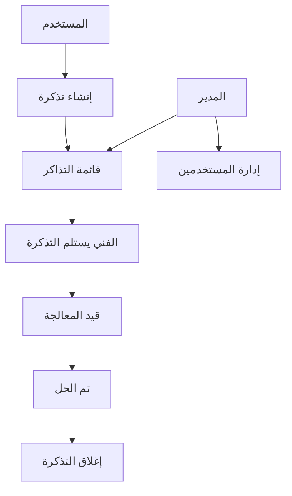
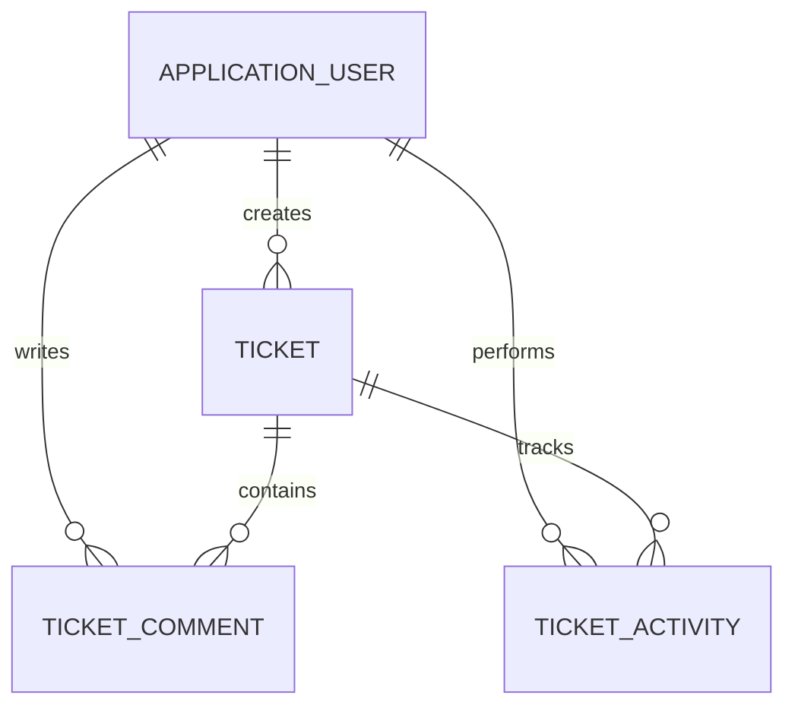

# الدليل العربي الكامل لمشروع IT Help Desk System

هذا الملف يشرح فكرة المشروع، طريقة بنائه، هيكل الملفات، قاعدة البيانات، تسجيل الدخول، الصلاحيات، دورة حياة التذكرة، الإضافات الجديدة، وأهم أجزاء الكود. الكود الكامل موجود داخل مجلد `src/HelpDesk.Web`.

## 1. ما وظيفة البرنامج؟

البرنامج نظام داخلي لإدارة طلبات الدعم الفني. المستخدم يفتح تذكرة ويحدد نوع المشكلة وأولويتها، ثم يستلمها فني الدعم ويحدّث حالتها ويتواصل مع المستخدم من خلال التعليقات. مدير النظام يستطيع متابعة جميع التذاكر وإدارة صلاحيات الحسابات.



## 2. التقنيات المستخدمة

| التقنية | استخدامها في المشروع |
|---|---|
| ASP.NET Core MVC 8 | تشغيل الموقع وتنظيم Controllers وViews وModels |
| C# | منطق البرنامج والتحقق من الصلاحيات |
| Entity Framework Core | التعامل مع قاعدة البيانات من خلال C# |
| SQLite | قاعدة بيانات محلية لا تحتاج تثبيت خادم |
| ASP.NET Identity | الحسابات وتشفير كلمات المرور والأدوار |
| Razor Views | إنشاء صفحات HTML مرتبطة ببيانات C# |
| CSS وJavaScript | التصميم المتجاوب والقائمة والتنبيهات |
| GitHub Actions | فحص بناء المشروع تلقائيًا بعد كل Push |
| Docker | تشغيل البرنامج داخل Container عند الحاجة |

## 3. كيف بدأ المشروع؟

تم إنشاء Solution باسم `HelpDeskSystem` وبداخله مشروع ويب واحد باسم `HelpDesk.Web`. ملف المشروع يستهدف `.NET 8` ويثبت حزمتين أساسيتين:

```xml
<TargetFramework>net8.0</TargetFramework>
<PackageReference Include="Microsoft.AspNetCore.Identity.EntityFrameworkCore" Version="8.0.30" />
<PackageReference Include="Microsoft.EntityFrameworkCore.Sqlite" Version="8.0.30" />
```

بعد ذلك قُسم البرنامج حسب أسلوب MVC:

- `Models`: شكل البيانات المخزنة.
- `Views`: الصفحات التي يراها المستخدم.
- `Controllers`: يستقبل الطلبات وينفذ منطق البرنامج.
- `Data`: الاتصال بقاعدة البيانات والبيانات التجريبية.
- `ViewModels`: بيانات مخصصة للصفحات والنماذج.
- `wwwroot`: ملفات CSS وJavaScript.

## 4. هيكل المشروع

```text
HelpDeskSystem/
├── .github/                  # الفحص التلقائي وقوالب GitHub
├── database/schema.sql       # توثيق جداول قاعدة البيانات
├── docs/                     # الشرح العربي وتعليمات النشر
├── screenshots/              # ضع صور البرنامج هنا
├── src/HelpDesk.Web/
│   ├── Controllers/
│   ├── Data/
│   ├── Models/
│   ├── ViewModels/
│   ├── Views/
│   ├── wwwroot/
│   ├── Program.cs
│   └── appsettings.json
├── Dockerfile
├── docker-compose.yml
├── HelpDeskSystem.sln
└── README.md
```

## 5. نقطة بداية التشغيل: Program.cs

عند تشغيل البرنامج يبدأ التنفيذ من `Program.cs`.

### تسجيل قاعدة البيانات

```csharp
builder.Services.AddDbContext<ApplicationDbContext>(options =>
    options.UseSqlite(connectionString));
```

هذا السطر يخبر Entity Framework باستخدام SQLite وسلسلة الاتصال الموجودة في `appsettings.json`:

```json
"DefaultConnection": "Data Source=helpdesk.db"
```

### تسجيل Identity

```csharp
builder.Services
    .AddIdentity<ApplicationUser, IdentityRole>(options =>
    {
        options.Password.RequiredLength = 8;
        options.User.RequireUniqueEmail = true;
    })
    .AddEntityFrameworkStores<ApplicationDbContext>();
```

Identity مسؤول عن إنشاء المستخدم، تشفير كلمة المرور، تسجيل الدخول، الكوكيز، والأدوار. كلمة المرور لا تُحفظ كنص عادي.

### ترتيب Middleware

```csharp
app.UseStaticFiles();
app.UseRouting();
app.UseAuthentication();
app.UseAuthorization();
```

الترتيب مهم: يحدد المسار أولًا، ثم يتعرف على المستخدم، ثم يفحص هل يملك الصلاحية المطلوبة.

### إنشاء قاعدة البيانات

```csharp
await db.Database.EnsureCreatedAsync();
await DbInitializer.InitializeAsync(scope.ServiceProvider);
```

عند أول تشغيل يُنشأ ملف `helpdesk.db` تلقائيًا، ثم تُنشأ الأدوار والحسابات والتذاكر التجريبية.

## 6. Models وقاعدة البيانات

### ApplicationUser

يمتد من `IdentityUser` ويضيف:

- `FullName`: اسم المستخدم.
- `CreatedAt`: تاريخ إنشاء الحساب.
- علاقات التذاكر والتعليقات والأنشطة.

### Ticket

يمثل التذكرة ويحتوي على:

| الخاصية | معناها |
|---|---|
| `Id` | رقم التذكرة |
| `Title` | عنوان مختصر للمشكلة |
| `Description` | التفاصيل الكاملة |
| `Category` | شبكة أو جهاز أو برنامج أو حساب أو أخرى |
| `Priority` | منخفضة أو متوسطة أو عالية أو حرجة |
| `Status` | مفتوحة أو قيد المعالجة أو محلولة أو مغلقة |
| `UserId` | صاحب التذكرة |
| `AssignedToId` | الفني المسؤول |
| `CreatedAt` | وقت الإنشاء |
| `UpdatedAt` | آخر تعديل |
| `DueAt` | المهلة المستهدفة للحل |

### TicketComment

كل تعليق مرتبط بتذكرة ومستخدم، ويحتوي على نص التعليق وتاريخ إضافته.

### TicketActivity

يسجل الحدث الذي حصل على التذكرة: الإنشاء، تغيير الحالة، الإسناد، التعليق، أو الإغلاق. هذا السجل منفصل عن التعليقات حتى لا تضيع تغييرات الحالة.



## 7. الصلاحيات

| العملية | User | Technician | Admin |
|---|:---:|:---:|:---:|
| إنشاء تذكرة | نعم | نعم | نعم |
| رؤية تذاكره | نعم | نعم | نعم |
| رؤية جميع التذاكر | لا | نعم | نعم |
| إضافة تعليق | نعم | نعم | نعم |
| تغيير الحالة | لا | نعم | نعم |
| إسناد التذكرة لنفسه | لا | نعم | نعم |
| تصدير CSV | لا | نعم | نعم |
| إدارة صلاحيات المستخدمين | لا | لا | نعم |

الحماية ليست في الواجهة فقط؛ كل Action حساس داخل Controller محمي مثل:

```csharp
[Authorize(Roles = "Admin,Technician")]
public async Task<IActionResult> UpdateStatus(...)
```

كما يفحص البرنامج ملكية التذكرة قبل عرض تفاصيلها للمستخدم العادي.

## 8. شرح Controllers

### AccountController

- `Login`: يبحث عن الحساب بالبريد ثم يستخدم `PasswordSignInAsync`.
- `Register`: ينشئ حسابًا ويضيف له دور `User` تلقائيًا.
- `Logout`: ينهي جلسة المستخدم.
- `AccessDenied`: صفحة تظهر عند محاولة فتح قسم دون صلاحية.

عند العودة إلى رابط بعد تسجيل الدخول يتم التحقق أنه رابط محلي لتجنب Open Redirect:

```csharp
if (Url.IsLocalUrl(model.ReturnUrl))
    return LocalRedirect(model.ReturnUrl);
```

### HomeController

يبني لوحة المعلومات. المستخدم العادي يحصل على إحصائيات تذاكره فقط، بينما المدير والفني يحصلان على إحصائيات النظام كله.

الإحصائيات الحالية:

- إجمالي التذاكر.
- المفتوحة.
- قيد المعالجة.
- المكتملة.
- الحرجة.
- المتجاوزة للمهلة.
- آخر ست تذاكر تم تحديثها.

### TicketsController

| Action | الوظيفة |
|---|---|
| `Index` | عرض التذاكر مع البحث والتصفية |
| `Details` | عرض الوصف والمحادثة وسجل النشاط |
| `Create` | إنشاء تذكرة وحساب مهلة الحل |
| `UpdateStatus` | تغيير الحالة وتسجيل التغيير |
| `AssignToMe` | إسناد التذكرة للفني الحالي |
| `AddComment` | إضافة تعليق وتسجيل النشاط |
| `Close` | إغلاق التذكرة |
| `ExportCsv` | تنزيل التذاكر المفلترة بصيغة CSV |

### AdminController

- `Users`: يعرض جميع الحسابات ودورها الحالي.
- `ChangeRole`: يغير الدور بعد التأكد أنه من الأدوار المسموحة.
- يمنع المدير من إزالة دور Admin من حسابه الذي يستخدمه حاليًا.

## 9. رحلة إنشاء تذكرة في الكود

1. المستخدم يفتح `Views/Tickets/Create.cshtml`.
2. يرسل النموذج إلى `TicketsController.Create` بطريقة POST.
3. `ModelState` يتحقق من العنوان والوصف.
4. يؤخذ `UserId` من المستخدم المسجل بدل استقباله من النموذج.
5. تحسب المهلة من الأولوية.
6. تحفظ التذكرة في SQLite.
7. يضاف حدث `Created` إلى سجل النشاط.
8. يعاد توجيه المستخدم إلى صفحة التفاصيل.

الجزء الأساسي:

```csharp
var ticket = new Ticket
{
    Title = model.Title.Trim(),
    Description = model.Description.Trim(),
    UserId = _userManager.GetUserId(User)!,
    Status = TicketStatus.Open,
    CreatedAt = DateTime.UtcNow
};

ticket.DueAt = TicketSla.CalculateDueAt(ticket.CreatedAt, ticket.Priority);
```

## 10. الإضافات الجديدة في الإصدار 1.1

### أ. نظام المهلة SLA

يحدد وقتًا مستهدفًا للحل حسب الأولوية:

| الأولوية | المهلة |
|---|---:|
| حرجة | 4 ساعات |
| عالية | 8 ساعات |
| متوسطة | 24 ساعة |
| منخفضة | 72 ساعة |

الكود موجود في `Models/TicketSla.cs`:

```csharp
TicketPriority.Critical => createdAt.AddHours(4),
TicketPriority.High => createdAt.AddHours(8),
TicketPriority.Medium => createdAt.AddHours(24),
TicketPriority.Low => createdAt.AddHours(72)
```

إذا تجاوزت التذكرة المهلة ولم تكن محلولة أو مغلقة يظهر عليها تنبيه «متأخرة».

### ب. سجل النشاط

الدالة التالية تضيف حدثًا موحدًا من داخل Controller:

```csharp
private void AddActivity(int ticketId, TicketActivityType type, string description)
{
    _db.TicketActivities.Add(new TicketActivity
    {
        TicketId = ticketId,
        UserId = _userManager.GetUserId(User)!,
        Type = type,
        Description = description,
        CreatedAt = DateTime.UtcNow
    });
}
```

صفحة التفاصيل تعرض الأنشطة بترتيب زمني، لذلك يستطيع المشرف معرفة من غيّر الحالة ومتى.

### ج. التصدير إلى CSV

الفني أو المدير يستطيع تصدير نتائج البحث الحالية. يضيف البرنامج BOM في بداية الملف حتى تظهر العربية بشكل صحيح في Excel:

```csharp
var bytes = Encoding.UTF8.GetBytes("\uFEFF" + csv);
return File(bytes, "text/csv; charset=utf-8", fileName);
```

### د. تجهيزات GitHub

- Workflow يبني المشروع تلقائيًا على كل Push وPull Request.
- Dependabot يقترح تحديثات شهرية للحزم.
- قوالب جاهزة للأخطاء والميزات وطلبات الدمج.
- `CONTRIBUTING.md` للمساهمين.
- `SECURITY.md` للإبلاغ الأمني.
- `CHANGELOG.md` لتوثيق الإصدارات.

### هـ. Docker

يمكن تشغيل البرنامج بعد تثبيت Docker:

```bash
docker compose up --build
```

ثم فتح:

```text
http://localhost:8080
```

قاعدة البيانات تحفظ داخل مجلد `data` ولا تضاف إلى Git.

## 11. شرح الواجهة

- `_Layout.cshtml`: الشريط الجانبي، الشريط العلوي، زر الخروج، والتنبيهات العامة.
- `Home/Index.cshtml`: بطاقات الإحصائيات وأحدث التذاكر.
- `Tickets/Index.cshtml`: البحث والتصفية والتصدير.
- `Tickets/Create.cshtml`: نموذج إنشاء التذكرة.
- `Tickets/Details.cshtml`: الوصف والتعليقات والنشاط وإجراءات الفني.
- `Admin/Users.cshtml`: تغيير الأدوار.
- `Account/Login.cshtml` و`Register.cshtml`: الدخول والتسجيل.
- `site.css`: الألوان والتجاوب وحالات التذاكر.
- `site.js`: قائمة الجوال وإخفاء التنبيهات تلقائيًا.

## 12. الأمان المطبق

- تشفير كلمات المرور بواسطة Identity.
- `[Authorize]` وRoles على العمليات الحساسة.
- فحص ملكية التذكرة للمستخدم العادي.
- Anti-forgery token على جميع نماذج POST.
- عدم أخذ `UserId` أو الصلاحية من المستخدم مباشرة.
- تحديد أطوال العنوان والوصف والتعليق.
- حماية حساب المدير من إزالة صلاحيته بالخطأ.
- تجاهل ملفات قواعد البيانات والأسرار في `.gitignore`.

قبل النشر العام يجب تغيير الحسابات التجريبية أو حذفها من `DbInitializer.cs`.

## 13. تشغيل المشروع في Visual Studio

1. ثبت Visual Studio 2022.
2. اختر Workload باسم `ASP.NET and web development`.
3. تأكد من تثبيت .NET 8 SDK.
4. افتح `HelpDeskSystem.sln`.
5. انتظر اكتمال Restore.
6. اختر `HelpDesk.Web` كمشروع بدء.
7. اضغط `F5`.

حسابات التجربة:

| الدور | البريد | كلمة المرور |
|---|---|---|
| مدير | `admin@helpdesk.local` | `Admin123!` |
| فني | `tech@helpdesk.local` | `Tech123!` |
| مستخدم | `user@helpdesk.local` | `User123!` |

## 14. تعديلات شائعة

### تغيير مهلة الأولوية

عدّل القيم في `Models/TicketSla.cs` ثم احذف `helpdesk.db` أثناء التطوير ليعاد إنشاؤها بالبيانات الجديدة.

### إضافة تصنيف جديد

أضف القيمة إلى `TicketCategory` في `Models/TicketEnums.cs`، ثم أضف ترجمتها في `ViewModels/TicketDisplay.cs`. القوائم في الصفحات تعتمد على Enum وستظهر القيمة تلقائيًا.

### تغيير قاعدة البيانات إلى SQL Server

1. استبدل حزمة SQLite بحزمة `Microsoft.EntityFrameworkCore.SqlServer`.
2. غيّر `UseSqlite` إلى `UseSqlServer` في `Program.cs`.
3. ضع Connection String الخاصة بـ SQL Server في الإعدادات الآمنة.
4. استخدم EF Core Migrations بدل `EnsureCreated` عند الإنتاج.

### تغيير ألوان الواجهة

عدّل المتغيرات في أعلى `wwwroot/css/site.css` مثل `--teal-600` و`--navy-950`.

## 15. الأخطاء الشائعة

### NETSDK1045

إصدار .NET 8 غير مثبت. ثبته من Visual Studio Installer ثم أعد فتح المشروع.

### فشل Restore

من Visual Studio اختر `Tools > NuGet Package Manager > Package Manager Settings` وتأكد من تفعيل `nuget.org`، ثم استخدم Restore NuGet Packages.

### تغيرت Models ولم تتغير القاعدة

المشروع يستخدم `EnsureCreated`. أثناء التطوير أغلق البرنامج واحذف `src/HelpDesk.Web/helpdesk.db` ثم شغله مجددًا. لا تفعل ذلك في نظام إنتاج يحتوي على بيانات حقيقية.

### شهادة HTTPS غير موثوقة

نفذ في Terminal:

```bash
dotnet dev-certs https --trust
```

## 16. رفع المشروع إلى GitHub

أنشئ Repository فارغًا في حسابك باسم `it-help-desk-system` ولا تضف README من موقع GitHub لأن المشروع يحتوي على README جاهز. بعد فك الضغط افتح Terminal داخل مجلد `HelpDeskSystem` ونفذ:

```bash
git init
git add .
git commit -m "feat: publish IT help desk system"
git branch -M main
git remote add origin https://github.com/5mlan/it-help-desk-system.git
git push -u origin main
```

بعد الرفع:

1. افتح تبويب Actions وتأكد أن فحص `.NET CI` نجح.
2. أضف وصفًا قصيرًا: `Role-based IT support ticket system built with ASP.NET Core MVC and SQLite.`
3. أضف Topics: `aspnet-core`, `mvc`, `entity-framework-core`, `sqlite`, `helpdesk`, `ticketing-system`, `arabic`, `rtl`.
4. شغل المشروع وخذ صورًا لصفحة الدخول واللوحة والتذكرة وإدارة المستخدمين.
5. ضع الصور في `screenshots` ثم أضفها إلى README.

## 17. وصف مناسب للسيرة الذاتية

> Developed a role-based IT Help Desk System using ASP.NET Core MVC, Entity Framework Core, ASP.NET Identity, and SQLite. Implemented secure authentication, ticket workflows, comments, activity auditing, SLA tracking, CSV export, responsive Arabic UI, automated CI, and Docker support.

## 18. أين يوجد الكود الكامل؟

الكود الكامل غير مختصر داخل المشروع:

- Backend: `src/HelpDesk.Web/Controllers`, `Data`, `Models`, و`ViewModels`.
- Frontend: `src/HelpDesk.Web/Views` و`wwwroot`.
- Database documentation: `database/schema.sql`.
- GitHub automation: `.github`.
- Container deployment: `Dockerfile` و`docker-compose.yml`.

ابدأ قراءة الكود بهذا الترتيب: `Program.cs` ثم `Models` ثم `ApplicationDbContext` ثم `DbInitializer` ثم Controllers ثم Views.
